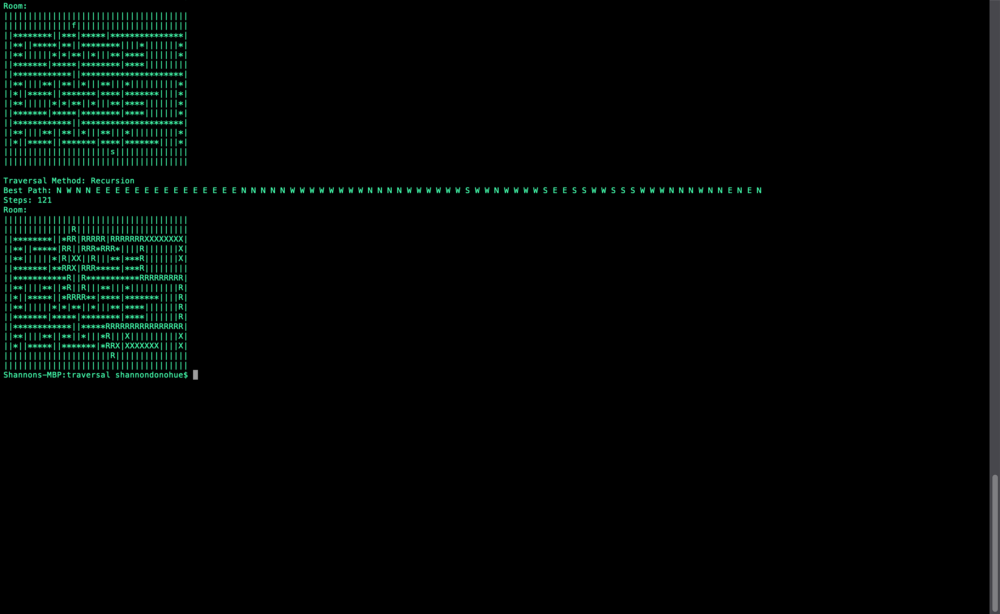

# traversalTypes
- An old program from 2018.
- Traverses a 2D maze with recursion.
- Should have been implemented with a graph, map, list or a more efficent data types rather than a vector.
- need to add different types of traversal methods (like dijkstra's  to compare the steps taken) 
- Start:  (s)
- Finish: (f)
- Empty:  (*)
- Wall:   (|)
- Compas Directions: (N,E,S,W)
- Robot move: (R)
- Backtrack:  (X)

